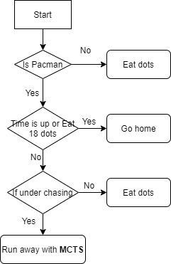

# AI Method 4 - Upper Confidence Trees 

We also tried Upper Confidence Trees (MonteCarlo Tree Search with Upper Confidence Bounds) as our Pacman AI planning algorithm. 

# Table of Contents
- [Contents](#Contents)
  * [Motivation](#motivation)
  * [Application](#application)
  * [Trade-offs](#trade-offs)     
     - [Advantages](#advantages)
     - [Disadvantages](#disadvantages)
  * [Future improvements](#future-improvements)

## Contents  
### Motivation 

As mentioned, Pacman game is a dynamic game with mutiple specific situations. Online planning such as MonteCarlo Tree Search sounds better for this kind of games compared with offline planning. At the same time, we know that MonteCarlo Tree Search already proved to has a satisfactory performance in a lot of Atari games. Therefore, we think MCTS should also perform well in pacman games. Also, with Upper Confidence Bounds technique, we can change exploration or exploitation of MCTS easily, to make the agent act more conservative or more greedy.

[Back to top](#table-of-contents)

### Application  

Because of time consumption of simulations, we are not running MCTS all the time. Insteadly, we are just using it when pacman is catching by enemy's ghosts. Because we already know, when there is no enemy's ghosts or our agent is going back home, classical planning like A* is already performed very well. 

When implementing MCTS algorithm, first we need to choose when to terminate. Because the calculation time of each step is very limited, it is hard to calculate the convergent tree within the pre-defined time limit, therefore, we choose to use up the simulation time (0.5 seconds per agent) as the terminal of MCTS.

[Back to top](#table-of-contents)

### Trade-offs  
#### *Advantages*  

#### *Disadvantages*

[Back to top](#table-of-contents)

### Future improvements  

[Back to top](#table-of-contents)
