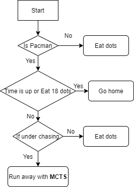

# AI Method 4 - Monte Carlo Trees Search

We also tried Upper Confidence Trees (MonteCarlo Tree Search with Upper Confidence Bounds) as our Pacman AI planning algorithm. 

# Table of Contents
- [Upper Confidence Trees](#Upper-Confidence-Trees)
  * [Motivation](#motivation)
  * [Application](#application)
  * [Trade-offs](#trade-offs)     
     - [Advantages](#advantages)
     - [Disadvantages](#disadvantages)
  * [Future improvements](#future-improvements)

## Upper Confidence Trees 
### Motivation 

As mentioned, Pacman game is a dynamic game with mutiple specific situations. Online planning such as MonteCarlo Tree Search sounds better for this kind of games compared with offline planning. At the same time, we know that MonteCarlo Tree Search already proved to has a satisfactory performance in a lot of Atari games. Therefore, we think MCTS should also perform well in pacman games. Also, with Upper Confidence Bounds or Epsilon greedy method, we can change exploration or exploitation of MCTS easily. Pacman is not a non-deterministic problem, every action has a deterministic outcome, which helps us simplify the MCTS algorithm.

[Back to top](#table-of-contents)

### Application  

Because of time consumption of simulations, we are not running MCTS all the time. Insteadly, we are just using it when pacman is catching by enemy's ghosts. Because we already know, when there is no enemy's ghosts or our agent is going back home, classical planning like A* is already performed very well. 



When implementing MCTS algorithm, first we need to choose when to terminate. Because the calculation time of each step is very limited, it is hard to calculate the convergent tree within the pre-defined time limit, therefore, we choose to use up the simulation time (0.5 seconds per agent) as the terminal of MCTS.

Then, we define node class, each node contains a gamestate, q value, visit times and other tree data structure things. MCTS has 4 stages: Selection, Expansion, Simulation and Backpropagation. We implement these stages in main function of MCTS.
```python
    def MCTS(node):
    timeLimit = 0.5
    start = time.time()
    while(time.time()-start < timeLimit):
        # Selection and expansion
        n = getExpandedNode(node) 
        # Simulation and calculate rewards
        reward = getReward(n)
        # Backpropagation
        backpropagation(n,reward)
    return getBestChild(node).action
```

In selection stage, we simply use epsilon greedy method and assign epsilon with 0.1.

In fact, what determines the performance of MCTS algorithm is the calculation process of the reward. Given number of features needs to be considered, we use features*weights again to calculate the reward. Generally speaking, when running away, we want our agent to eat capsule/avoid eaten by ghost/stay away from ghost, at the same time, taking into account the efficiency of eating dots. Therefore, we assing 'avoid eaten' and 'eat capsule' feature with major weight, 'stay away from ghost' with middle weight, 'get closer to food' and 'eat food' with minor weight.

[Back to top](#table-of-contents)

### Trade-offs  
#### *Advantages*  
Through experiment, we get a result above staff team top. Facts have proved that this online planning method is quite effective for solving dynamic planning problems.

#### *Disadvantages*
MCTS requires a lot of computing power. When the limited computing time is too short, the simulation will not be well performed. 

[Back to top](#table-of-contents)

### Future improvements  
Due to the limited project time, we only tried to use MCTS in a special case. We may try to use this method globally in the future to expect more concise and unified idea and better performance.

[Back to top](#table-of-contents)
