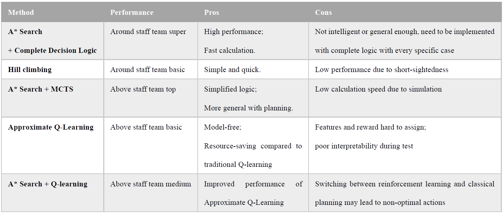

# Design Choices

## General Comments

We compared several AI planning algorithms or hybrid algorithms with their performance in Pacman game. For seeing implemetation of these methods, please go to seperate wiki file of each method. 

In the end, we chose the first method with the best performance.

## Comments per topic

* A* Search with Complete Decision Logic:

This is the method we focus on with whole cycle of evolution. For details, see [AI-Method-1](https://github.com/COMP90054-classroom/contest-a-team/blob/master/wiki-template/AI-Method-1.md) and [Evolution](https://github.com/COMP90054-classroom/contest-a-team/blob/master/wiki-template/Evolution.md). It has a really high performance in the contest. Besides, its high interpretability helps us to optimize the strategy, including the tuning of parameters and the change of behavior. However, because Heuristic Search Algorithms is too simple and straightforward, our agent cannot learn in a large number of competitions, namely, it is not inherently intelligent. Thus, it took us a lot of time and energy to debug and improve this method.

Performance in the contest: Around staff team super

* Hill Climbing:

This is simple idea we first came out with intuitive think of improving the default baseline method. For details, see [AI-Method-1](https://github.com/COMP90054-classroom/contest-a-team/blob/master/wiki-template/AI-Method-3.md). Its implementation is simple and straightforward, but its performance is fairly limited. Maybe we can improve its performance by implementing more presice decision logic for different cases. However, We did not focus on this method because it was easily defeated by our other methods.

Performance in the contest: Around staff team basic

* 

## Offense

Through experiments, we find that aggressive strategy of eating dots is more effective, namely, both agents play the role of attackers at most of the time. Because when facing intelligent opponents, defense is very difficult and inefficient. As the saying goes: attack is the best defense. You can't win the Pacman game by defending.

This is comparison between our less-denfence version and more-defence version:
* Less-denfence version:

* More-denfence version:

## Defense
For defense cases, the agent first find a path to enemy's Pacman. If there is no feasible path, then the agent will go to location of last dot eaten by enemy's Pacman.