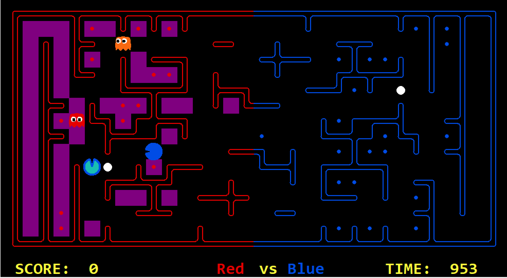
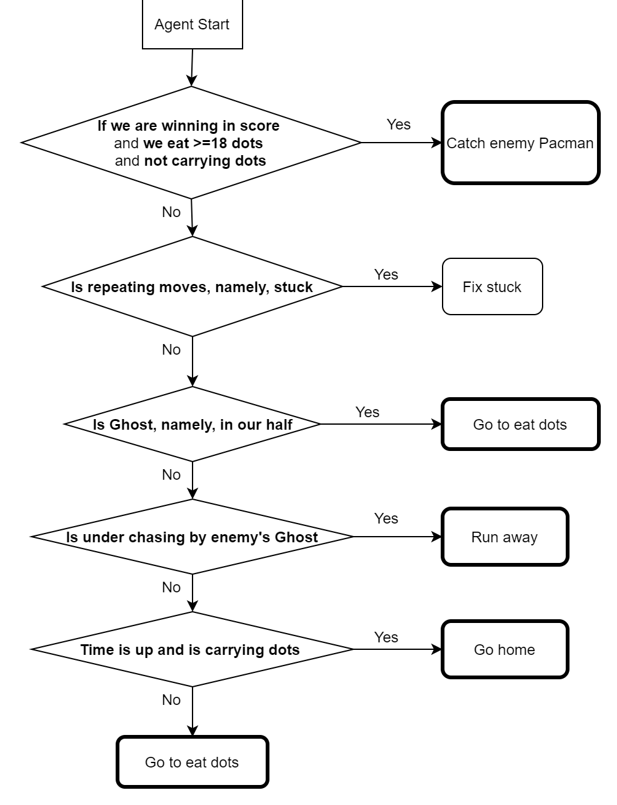
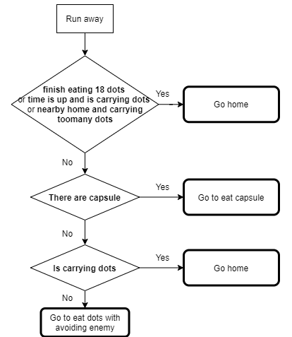

# Design Choices

Through experiments, we find that aggressive strategy of eating dots is more effective, namely, both agents play the role of attackers at most of the time. Because when facing intelligent opponents, defense is very difficult and inefficient. As the saying goes: attack is the best defense. You can't win the Pacman game by defending.

In addition, we compared several AI planning algorithms or hybrid algorithms with their performance in Pacman game. For seeing implemetation of these methods, please go to seperate wiki file of each method. 

In the end, we chose the first method with the best performance.

## General Comments

First, our program will analyze the map, including the inherent danger zone (Dead end) and their exit. In some subsequent cases, the agent will be prevented from entering such an area. At the same time we give some useful help functions.

As shown in the figure, green tiles are dead ends and bule tiles are their exit.

In the running process of this dynamic Pacman game, we need to constantly judge the dangerous position for our agent. It may be different for different cases, including but not limited to the dead end mentioned above or locations near the enemy Ghost.

With dangerous area and gamestate, agent action is determined by the cases subdivided by the logic of a decision tree.

In the figure above, all outcomes with bold border are implemented with A* search algorithm.

## Comments per topic

There is a sub logic when agent needs to run away from enemy. 

Generally, our agent's action chosing cases goes into three functions: Eat capsule, Eat dots and Go home. We implement A star search in all these cases. For eat dots funuction, we need to make our two agents as a combination to get the highest efficiency of eating dots, instead of considering only one agent itself. Intuitively, if two agents are separated, eating dots from different areas will avoid the conflict between the two agents and imporve the performance. We implement an algorithm which is the Pacman will eat the first nearest dot which is located in the different order in another Pacman's eating list. This strategy can prevent two Pacmen from moving to the same direction or region.

## Offense
Most comments above is about the Offense strategy.

## Defense
For defense cases, the agent first find a path to enemy's Pacman. If there is no feasible path, then the agent will go to location of last dot eaten by enemy's Pacman.