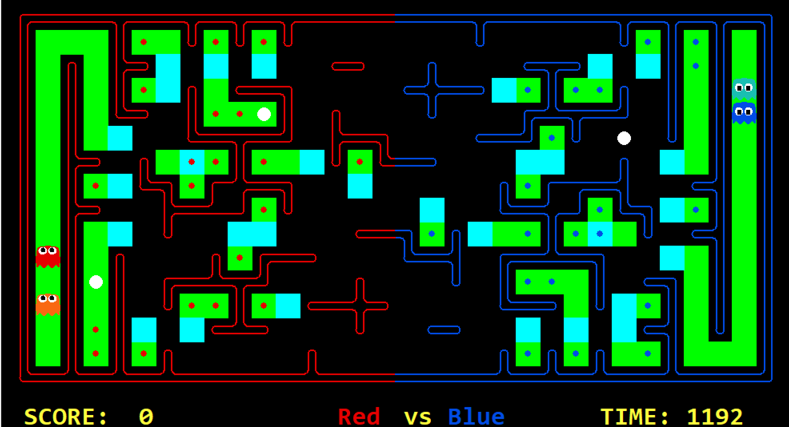

# Design Choices

First, our program will analyze the map, including the inherent danger zone (Dead end) and their exit. In some subsequent cases, the agent will be prevented from entering such an area. At the same time we give some useful help functions.

As shown in the figure, green tiles are dead ends and bule tiles are their exit.

Then, agent action is determined by the cases subdivided by the logic of a decision tree.

## General Comments

_General comments about the project goes here_

## Comments per topic

## Offense

## Defense
