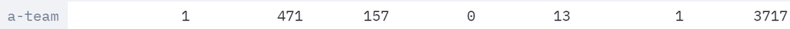
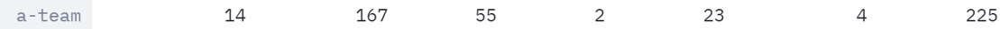

# Design Choices

## Choice 1       A Star or Hill Climbing

### Performance Comparison
In order to execute Heuristic Search Algorithms, we have completed two versions of agents. One is based on the A Star algorithm, and the other is based on the Hill Climbing algorithm. Since the Test Contest did not start when these two versions were completed, we used the built-in layouts to conduct internal competitions against these two agents. The results are shown in the following table ((9/10) means 9 out of 10 games won):

|  Layouts   | Winner |
|  :----  | :----  |
| alleyCapture  | A Star(9/10) |  
| bloxCapture  | A Star(8/10)| 
|  crowdedCapture | A Star(10/10) | 
|  defaultCapture | A Star(10/10) | 
| distantCapture  | A Star(8/10) | 
|  fastCapture |A Star(7/10)  | 
| jumboCapture  |A Star(10/10)  | 
|  mediumCapture |A Star(7/10)  | 
| officeCapture  | A Star(10/10) | 
| strategicCapture  | A Star(10/10) | 

### Agent Choice
The results of the game showed that the A Star algorithm achieved an overwhelming victory. Therefore, we finally decided to use this version of the agent as the initial choice.

### Analysis and Discussion
In fact, even though the A Star version completely beats the Hill Climbing version, this does not mean that the A Star algorithm is completely better than the Hill Climbing algorithm in the Pacman competition. By comparing the code logic, we found that the Hill Climbing version of the agent has many logical contradictions, and the judgment and decision-making of Pacman's behavior is not perfect, and the overall completion is far from the A Star version. However, since these two agents are based on cla, the final performance should not be much different. In view of the good logical judgment and better performance of the A Star version, we decided to further optimize and improve it.

## General Comments

We compared several AI planning algorithms or hybrid algorithms with their performance in Pacman game. For seeing implemetation of these methods, please go to seperate wiki file of each method. 

In the end, we chose the first method with the best performance.

## Comments per topic

* A* Search with Complete Decision Logic:

This is the method we focus on with whole cycle of evolution. For details, see [AI-Method-1](https://github.com/COMP90054-classroom/contest-a-team/blob/master/wiki-template/AI-Method-1.md) and [Evolution](https://github.com/COMP90054-classroom/contest-a-team/blob/master/wiki-template/Evolution.md). It has a really high performance in the contest. Besides, its high interpretability helps us to optimize the strategy, including the tuning of parameters and the change of behavior. However, because Heuristic Search Algorithms is too simple and straightforward, our agent cannot learn in a large number of competitions, namely, it is not inherently intelligent. Thus, it took us a lot of time and energy to debug and improve this method.

Performance in the contest: Around staff team super

* Hill Climbing:

This is simple idea we first came out with intuitive think of improving the default baseline method. For details, see [AI-Method-3](https://github.com/COMP90054-classroom/contest-a-team/blob/master/wiki-template/AI-Method-3.md). Its implementation is simple and straightforward, but its performance is fairly limited. Maybe we can improve its performance by implementing more presice decision logic for different cases. However, We did not focus on this method because it was easily defeated by our other methods.

Performance in the contest: Around staff team basic

* Monte Carlo Tree Search:

We came out with this method because we knew from the lectures that Monte Carlo Tree Search is very suitable for real-time AI planning for dynamic games like Pacman. For details, see [AI-Method-4](https://github.com/COMP90054-classroom/contest-a-team/blob/master/wiki-template/AI-Method-4.md). We added MCTS to the main method as an attempt. It turns out that it can help simplify the complicated logic of using only A* searching. However, it is not significantly improved in performace compared with the main method, so we did not choose it finally.

Performance in the contest: Above staff team top

* Approximate Q Learning:

This is our tentative verification of Q Learning methods. It is a model-free reinforcement learning technique to make the Pacman agents learn policies through experience and win the game automatically by applying the learnt policies. For details, see [AI-Method-5](https://github.com/COMP90054-classroom/contest-a-team/blob/master/wiki-template/AI-Method-5.md). However, due to the inherent complexity of the problem, the features and reward used could not fully capture the states and the outcome of our initial attempt of using approximate q-learning alone was poor. Therefore, to improve the performance, we proposed a hybrid approach by combining approximate q-learning with classical planning which is the following method.

Performance in the contest: Above staff team basic

## Offense

Through experiments, we find that aggressive strategy of eating dots is more effective, namely, both agents play the role of attackers at most of the time. Because when facing intelligent opponents, defense is very difficult and inefficient. As the saying goes: attack is the best defense. You can't win the Pacman game by defending.

This is comparison between our less-denfence version and more-defence version:
* Less-denfence version:

* More-denfence version:

## Defense
For defense cases, the agent first find a path to enemy's Pacman. If there is no feasible path, then the agent will go to location of last dot eaten by enemy's Pacman.
