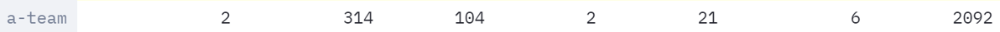
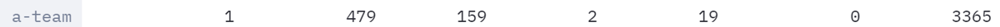
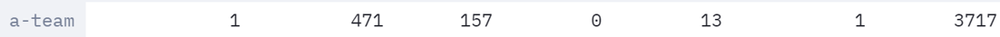

# Evolution of the approach

Here is evolution of our agent with Heuristic Search Algorithm.

## My First Agent - First Version with Heuristic Search Algorithm

As mentioned in [AI-Method-1](https://github.com/COMP90054-classroom/contest-a-team/blob/master/wiki-template/AI-Method-1.md) and [Design-Choices](https://github.com/COMP90054-classroom/contest-a-team/blob/master/wiki-template/Design-Choices.md), our initial agent laid the foundation for all the subsequent improvements. It is using A* search algorithm with action decision logic and map reading functions. Also, we do not seperate offense and defense agent, insteadly, our agent judges its action by the game state (in fact, our agent spends most of the time on attack). Just like any other foundimental approach, it has many shortcomes, including but not limited to:
* aaaaaa
* bbbbbbb
* cccccccc

### Demo

#### Competition results: Position - 4/14 | Percentile - 29% | Above staff team medium

#### Strategy summary

| Pros | Cons |
|-----------------|:-------------|
| First body part | Second cell  |
| Second line     | foo          |
----
## My Second Agent - Second Version: Less Greedy
----

Improved:
* aaaaaaaaaaaa
* bbbbbbbbbbbb
* cccccccccccc

### Demo

#### Competition results: Position - 2/14 | Percentile - 14% | Above staff team top

#### Strategy summary

| Pros | Cons |
|-----------------|:-------------|
| First body part | Second cell  |
| Second line     | foo          |
----
## My Third Agent - Third Version: Stuck Fix
----

Improved:
* Stuck fix

### Demo

#### Competition results: Position - 1/19 | Percentile - 5% | Above staff team super

#### Strategy summary

| Pros | Cons |
|-----------------|:-------------|
| First body part | Second cell  |
| Second line     | foo          |
----
## My Fourth Agent - Fourth Version: Add More Defence
----

Added:
* More Defence

### Demo

#### Competition results: Position - 14/81 | Percentile - 17% | Above staff team top

#### Strategy summary

| Pros | Cons |
|-----------------|:-------------|
| First body part | Second cell  |
| Second line     | foo          |
----
## My Fifth Agent - Fifth Version: Improve Eat-Dots Logic
----

Improved:
* Change eat dots logic

### Demo

#### Competition results: Position - 1/86 | Percentile - 1% | Above staff team super

#### Strategy summary

| Pros | Cons |
|-----------------|:-------------|
| First body part | Second cell  |
| Second line     | foo          |
