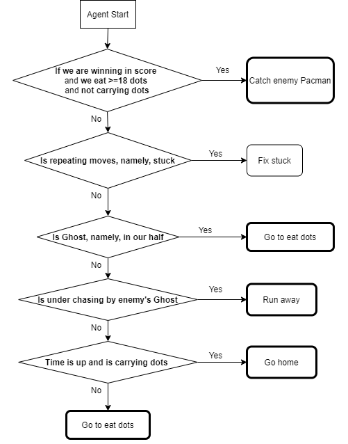

# Evolution of the approach

Here is evolution of our agent with Heuristic Search Algorithm.

## My First Agent - First Version with Heuristic Search Algorithm

As mentioned in [AI-Method-1](https://github.com/COMP90054-classroom/contest-a-team/blob/master/wiki-template/AI-Method-1.md), our initial agent is using A* search algorithm with action decision logic and map reading functions. Also, we do not seperate offense and defense agent, insteadly, our agent judges its action by the game state (in fact, our agent spends most of the time on attack). 

First, our program will analyze the map, including the inherent danger zone (Dead end) and their exit. In some subsequent cases, the agent will be prevented from entering such an area. At the same time we give some useful help functions.

As shown in the figure, green tiles are dead ends and bule tiles are their exit.

In the running process of this dynamic Pacman game, we need to constantly judge the dangerous position for our agent. It may be different for different cases, including but not limited to the dead end mentioned above or locations near the enemy Ghost.

With dangerous area and gamestate, agent action is determined by the cases subdivided by the logic of a decision tree.

In the figure above, all outcomes with bold border are implemented with A* search algorithm.

There is a sub logic when agent needs to run away from enemy. 

Generally, our agent's action chosing cases goes into three functions: Eat capsule, Eat dots and Go home. We implement A star search in all these cases. For eat dots funuction, we need to make our two agents as a combination to get the highest efficiency of eating dots, instead of considering only one agent itself. Intuitively, if two agents are separated, eating dots from different areas will avoid the conflict between the two agents and imporve the performance. We implement an algorithm which is the Pacman will eat the first nearest dot which is located in the different order in another Pacman's eating list. This strategy can prevent two Pacmen from moving to the same direction or region.

### Demo

#### Competition results: Position - 4/14 | Percentile - 29% | Above staff team medium

#### Strategy summary

Our initial agent laid the foundation for all the subsequent improvements. However, just like any other foundimental approach, it has many shortcomes, including but not limited to:
* aaaaaa
* bbbbbbb
* cccccccc

| Pros | Cons |
|-----------------|:-------------|
| First body part | Second cell  |
| Second line     | foo          |
----
## My Second Agent - Second Version: Less Greedy
----

Improved:
* aaaaaaaaaaaa
* bbbbbbbbbbbb
* cccccccccccc

### Demo

#### Competition results: Position - 2/14 | Percentile - 14% | Above staff team top

#### Strategy summary

| Pros | Cons |
|-----------------|:-------------|
| First body part | Second cell  |
| Second line     | foo          |
----
## My Third Agent - Third Version: Stuck Fix
----

Improved:
* Stuck fix

### Demo

#### Competition results: Position - 1/19 | Percentile - 5% | Above staff team super

#### Strategy summary

| Pros | Cons |
|-----------------|:-------------|
| First body part | Second cell  |
| Second line     | foo          |
----
## My Fourth Agent - Fourth Version: Add More Defence
----

Added:
* More Defence

### Demo

#### Competition results: Position - 14/81 | Percentile - 17% | Above staff team top

#### Strategy summary

| Pros | Cons |
|-----------------|:-------------|
| First body part | Second cell  |
| Second line     | foo          |
----
## My Fifth Agent - Fifth Version: Improve Eat-Dots Logic
----

Improved:
* Change eat dots logic

### Demo

#### Competition results: Position - 1/86 | Percentile - 1% | Above staff team super

#### Strategy summary

| Pros | Cons |
|-----------------|:-------------|
| First body part | Second cell  |
| Second line     | foo          |
